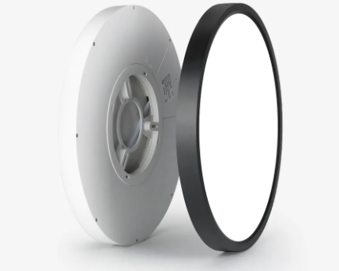
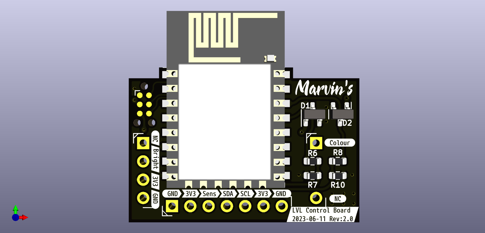
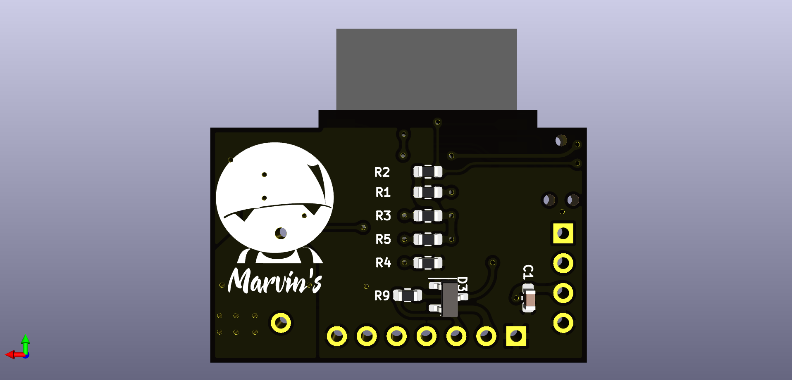

# ESP8266 LVL Light Control Board

This project contains the KiCad design files for a replacement control board used to control the LVL ceiling light (https://templates.blakadder.com/lvl_300.html) with additional features such as brightness adjustment, colour temperature control (CCT) and Wi-Fi connectivity. The board also includes provisions for connecting an I2C bus, a GPIO and power supply (3V3, GND).

## Features

- Control LVL ceiling light using ESP8266-12F
- Adjust brightness and color temperature (CCT)
- Wi-Fi connectivity for remote control and automation
- I2C bus and GPIO for additional device integration

## Board

32 mm x 20 mm (without antenna overlap)

### Front

### Back

## Contributing

Contributions are welcome! If you find any issues or have suggestions for improvements, please open an issue or submit a pull request.

